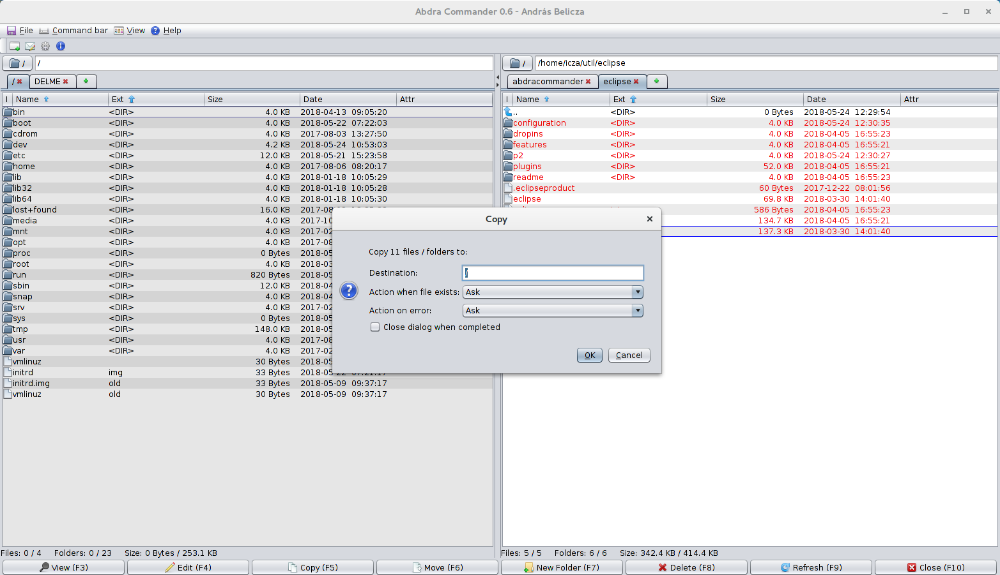

# Abdra Commander

A 2-pane file manager written in Java.

## Features

- Completely written in Java, so you can use / run it in any operating systems.

- Uses the native I/O capabilities introduced in Java 7.0.

- Multi-window and multi-tab support.

- Extensive configuration.

- Easily extendable, extensive column list.

- Easily extendable file operations.

## Screenshot

# Status

Project was developed between September 26, 2012 and January 5, 2013.
Project is unmaintained.
